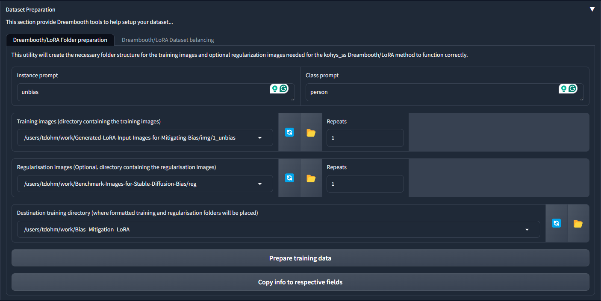
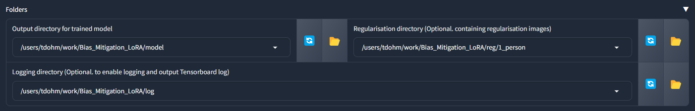
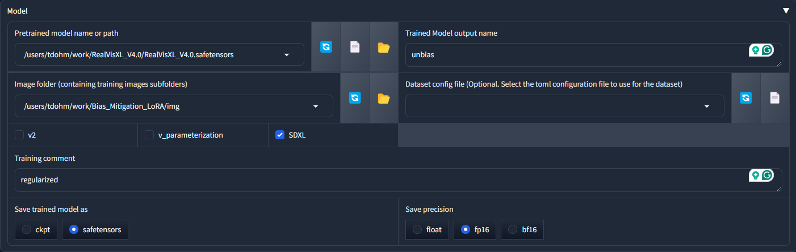

# LoRA Training for Stable Diffusion Bias Mitigation

This repository contains the necessary files and instructions for training a Low-Rank Adaptation (LoRA) model to mitigate biases in Stable Diffusion using the Kohya_ss training scripts.

## Prerequisites

- Python 3.x
- Kohya_ss training scripts ([GitHub Repository](https://github.com/bmaltais/kohya_ss))

## Getting Started

1. Clone this repository:
   
```
git clone https://github.com/your-username/lora-training.git
cd lora-training
```

2. Install the required dependencies:
   
```
pip install -r requirements.txt
```

## Data Preparation

1. Pull the training data from Hugging Face:

```
git lfs install
git clone https://huggingface.co/datasets/<dataset_name>
```

2. Excise the captions from the training data using the `excision.py` script:

```
python excision.py --input_folder <input_folder> --output_folder <output_folder>
```

- `<input_folder>`: Path to the folder containing the original training data.
- `<output_folder>`: Path to the folder where the excised data will be saved.

3. Organize the excised data according to the folder structure shown in `dataset.png` and `folders.png`.


*Figure 1: Required folder structure for the training dataset.*


*Figure 2: Additional folder structure required for training.*

The `dataset.png` and `folders.png` images provide a visual representation of the necessary folder structure for organizing the training data. Ensure that your excised data follows this structure before proceeding with the training.

## LoRA Training

1. Set up the Kohya_ss training script by following the instructions on their GitHub page: [Kohya_ss GitHub Repository](https://github.com/bmaltais/kohya_ss)

2. Load the training configurations from `unbias.json` at the top of the Kohya_ss GUI.


*Figure 3: Important model configuration details.*

The `model.png` image contains important information such as the Stable Diffusion version and LoRA output name. Use these details to set up your training configuration in the Kohya_ss GUI.

3. Adjust the training settings according to your requirements. Refer to `model.png` for important information such as the Stable Diffusion version and LoRA output name.

4. Start the training process using the Kohya_ss GUI or command-line interface.

## File Descriptions

- `dataset.png`: Displays the necessary folder structure for training.
- `excision.py`: Python script for performing prompt excision on the training data.
- `folders.png`: Additional image illustrating the required folder structure.
- `model.png`: Contains important information such as the Stable Diffusion version and LoRA output name.
- `requirements.txt`: Lists the required Python dependencies.
- `unbias.json`: JSON file containing the training configurations for bias mitigation.
- `unpack.py`: Python script for unpacking the training data (if applicable).

## Additional Resources

- [Kohya_ss GitHub Repository](https://github.com/bmaltais/kohya_ss)
- [Stable Diffusion](https://stability.ai/blog/stable-diffusion-public-release)
- [LoRA: Low-Rank Adaptation of Large Language Models](https://arxiv.org/abs/2106.09685)

## Acknowledgments

- The Kohya_ss training scripts developed by [bmaltais](https://github.com/bmaltais)
- The Stable Diffusion model and community for their contributions to the field of generative modeling.

Please refer to the individual files and the Kohya_ss documentation for more detailed information on each step of the training process.
